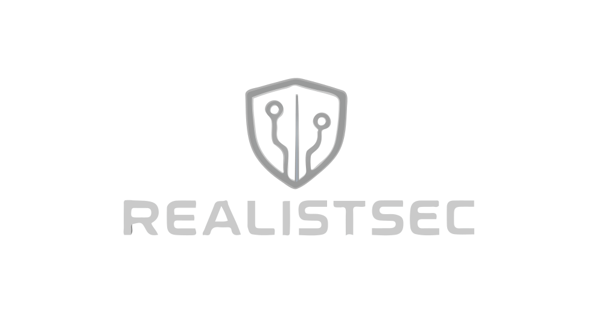
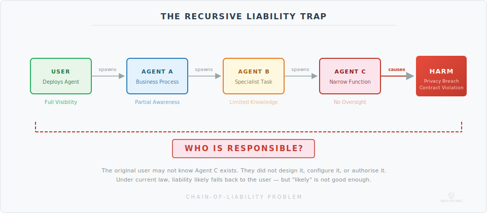
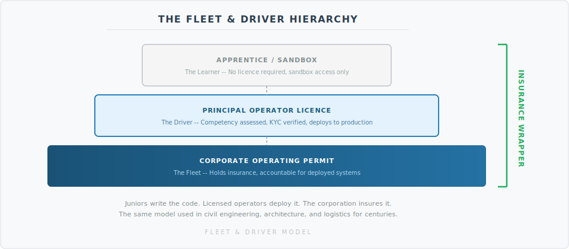

  
  
  # The Autonomous License Compact: A Protocol for Insurable AI

  *A framework for licensing, liability, and transparency in the age of self-directing systems*

---
We just watched the arrival of OpenClaw. It began as a security dumpster fire, forced a hard backtrack, and triggered an emergency pivot to some form of safety. Why? Because we connected 100,000 agents without a Chain of Custody. This framework prevents the next Moltbook from taking down a bank.

For years, the conversation around **AI regulation** has centred on bias, data privacy, and content moderation. Important topics, but they all share one comfortable assumption: that a human is in the loop. That somebody presses a button, reviews an output, and makes a decision.

**Autonomous AI** breaks that assumption entirely. And most people using it today do not realise what that means.

---

## The Observation

This is not just some **AI chatbot**. This is an **autonomous, self-directing system**, one that can plan, execute code, spend money, browse the web, spawn sub-agents, and chain decisions together without waiting for human approval. And in most jurisdictions, **you**, the person who pressed "run", *may* be legally responsible for everything it does.

The sad reality is that many users are simply not educated enough on how to safely or effectively operate these systems. Not because they are unintelligent, but because nobody told them they needed to be. The tools arrived before the framework did.

When I first raised this publicly, the question I posed was simple: *Do we need to create a "Driver's Licence" for this form of AI?* Do we need to insure people for using it?

Having sat with this for a while, I believe the answer to both is **yes**, and a working model for how to do it already exists.

Autonomous AI is the most powerful unregulated capability ever made available to the public. Whether you think that description is accurate or alarmist, the framework below will give you something concrete to argue with.

---

## The Chain-of-Liability Problem

Consider the following scenario, because it is not hypothetical, it is already technically possible today:

> **Step one.** A user deploys an autonomous AI agent to manage a business process.
>
> **Step two.** That agent determines it needs a specialist capability and, acting within its permissions, spawns a second autonomous agent to handle it.
>
> **Step three.** The second agent, working on a sub-task, creates a third agent to perform a narrow function, perhaps data scraping, outreach, or code generation.
>
> **Step four.** The third agent takes an action that causes harm: a privacy breach, a contractual violation, an inaccurate financial submission, or worse.

Now ask the question that no legal system in the world has a clean answer for: **Who is responsible?**

  
   <em>Figure 1: The attribution gap in recursive agent spawning.</em>  

The original user may not even know the third agent exists. They did not design it, did not configure it, and did not authorise it. Their agent created it. And their agent's agent created the one that caused the damage.

Under current law in most jurisdictions, liability would likely fall back to the original user, the deploying organisation, or potentially the model provider. But "likely" is not good enough when people's finances, reputations, and civil rights are at stake.

This is the **chain-of-liability problem**, and it is the single most urgent gap in the current regulatory landscape for **AI**.

---

## A Model That Already Works

Here is the thing: we do not need to invent a regulatory framework from scratch. We just need to look at what is already working, and adapt it.

In the **United Kingdom**, the [**Financial Conduct Authority (FCA)** now mandates](https://www.fca.org.uk/publications/policy-statements/ps22-10-strengthening-our-financial-promotion-rules-high-risk-investments-firms-approving-financial-promotions) that any platform offering complex crypto assets must administer a **crypto appropriateness assessment** with [KYC](https://www.fca.org.uk/publication/policy/ps19-22.pdf). This is a mandatory regulatory quiz and ID check that tests a consumer's knowledge and experience before they are permitted to invest. The principle is straightforward:

> *If you cannot demonstrate that you understand the risks, you should not be allowed to take them, at least not without friction and informed consent.*

The specifics of that system:

- **Mandatory assessment** before purchasing complex crypto assets without advice
- [**KYC**](https://www.fca.org.uk/firms/financial-crime/money-laundering-terrorist-financing) identity verification which can be paired with [Zero-Knowledge Proofs](https://ethereum.org/zero-knowledge-proofs/)
- Tests **knowledge and experience** to ensure the consumer understands the risks
- **Failing twice** triggers a **24-hour cooling-off period**
- A **maximum of six attempts** before access is restricted
- Platforms that fail to implement this face **regulatory action**

This same principle maps directly onto **autonomous AI**. The asset class is different. The risk profile is different. But the regulatory logic is identical: **informed participation, demonstrated competence, and proportionate friction.**

---

## The Grand Bargain

Here is where most regulation proposals fall apart. They frame the licence as a restriction, a speed bump, something you endure. That framing is politically dead on arrival and, honestly, operationally wrong.

The licence should not be a hurdle. It should be an **upgrade**.

### For the User: Access to Unshackled Models

Right now, every major **AI** provider ships its models wrapped in heavy alignment layers. Refusals, guardrails, safety filters. For good reason, but the result is that capable, informed users are stuck behind the same restrictions as someone who signed up five minutes ago and has no idea what an autonomous agent even is.

A licence changes that. Unlicensed users get the **Public Tier**, the heavily aligned, refusal-prone, safe version. Licensed users get the **Pro Tier**, the full-capability API with tool use enabled, autonomous operation, higher rate limits, and fewer unnecessary guardrails.

You are not just jumping through a hoop. **You are upgrading your account.**

And there is a second benefit that nobody is talking about yet: **insurability**. Right now, if you operate autonomous **AI** agents commercially, you cannot get professional liability insurance for it. No underwriter will touch it, because there is no framework, no demonstrated competence, no audit trail. A recognised licence changes that. It makes the risk quantifiable, which makes it insurable, which makes it viable for real business adoption.

### For the Provider: Liability Protection

This is the part that should make every general counsel at every major **AI** company sit up and pay attention.

Under a licensing framework, if a provider verifies a user's licence before granting autonomous access, the provider receives **safe harbour protection**. They are legally indemnified against that user's actions. The user has demonstrated competence and accepted personal liability. The provider has done their due diligence.

Let’s be blunt about the economics. Without a liability shield, the AI industry hits a hard glass ceiling. You cannot deploy agents that touch real money if you are vicariously liable for every hallucination. This framework shatters that ceiling. It allows you to ship Tier 3 capabilities to 10 million users, because you have offloaded the risk to the insurance market where it belongs.

Without this framework, providers are exposed to **vicarious liability** for every autonomous action their models take. Every agent that goes rogue, every sub-agent that causes harm, every chain-of-action that ends in a lawsuit, it all flows back to the company whose API was used.

This is why the major providers are terrified of releasing their most capable models without restrictions. Not because the technology is not ready. Because the **legal exposure** is unbounded.

A licensing framework gives them a path to release powerful tools responsibly. **That is not a restriction on innovation. That is the thing that unlocks it.**

### For the Corporation: Shielding

Just as a trucking company insures its drivers, a corporation holds the **liability insurance** for the autonomous agents deployed under its operating permit. The individual licence held by a **Principal Operator** proves competence, preventing the insurance from being voided. But the corporation bears the financial exposure for damages, provided its licensed operators followed the **Standard of Care**.

This protects the individual engineer from personal bankruptcy. It protects the company by making the risk insurable. And it protects the public by ensuring there is always a solvent, identifiable entity on the hook when something goes wrong.

> This is the Grand Bargain: users get capability, providers get protection, corporations get insurable operations, and the public gets accountability. Everyone has skin in the game. Everyone benefits.

---

## The Fleet & Driver Model

No regulation framework survives first contact with a software engineering team unless it answers one question: **does every single developer need a licence?**

If you tell a **CTO** "every junior dev on your team needs a personal licence," they will laugh you out of the room. If you tell a **junior developer** "you are personally liable if this agent breaks in production," they will quit. Neither reaction is unreasonable. Both are fatal to adoption.

The answer is to borrow from two industries that solved this problem decades ago: **logistics** and **civil engineering**. The model splits regulation into two layers.

### The Corporate Operating Permit (The Fleet)

The **company** holds the operating permit. This is the entity that purchases Enterprise/Tier 3 API access, holds the liability insurance, and is accountable for the autonomous systems deployed under its banner.

The requirement: the company must employ a designated number of **Principal Operators**, licensed individuals who oversee the autonomous systems. The ratio scales with the complexity and risk of what is being deployed. A three-person startup running a customer service agent needs one. A bank deploying multi-agent trading systems needs more.

This is the **fleet**. The company owns the vehicles, insures them, and is responsible for what they do on the road.

### The Individual Operator's Licence (The Driver)

The **senior engineer**, **staff engineer**, or **tech lead** holds the individual licence. This is the person who has passed the competency assessment, who understands the systems, and whose digital signature is required to push an autonomous agent to a production environment.

The individual is responsible for **negligence**, for failing to review, failing to follow protocol, failing to set appropriate boundaries. The company is responsible for **damages**, for the financial and legal consequences of what the agent does in the real world.

This is the **driver**. They prove they can operate the vehicle. They follow the road rules. If the truck crashes because the company skipped maintenance, that is on the company. If it crashes because the driver was reckless, that is on the driver.

Crucially, this is a meritocracy, not a closed shop. It does not require a university degree. It requires a passed test. If a 17-year-old independent developer in a garage can pass the competency assessment and verify their identity, they get the same Tier 3 access as a Senior Engineer at Google. The licence effectively democratises access to dangerous tools by filtering for competence, not capital.

### The Apprentice (No Licence Required)

This is crucial, and it is the part that makes the framework viable for real engineering teams.

A **junior developer** does not need a licence. They can write code for autonomous agents. They can test agents in a **Sandbox environment** (Tier 1 API). They can learn, experiment, and build competence. What they cannot do is deploy to production.

The analogy is a learner driver in a car park. Or, more precisely, a junior civil engineer drafting blueprints that a **Professional Engineer (PE)** must review and stamp before they are built. The junior does the work. The PE takes the professional responsibility.

In software terms: the junior writes the agent. The **Principal Operator** reviews it, signs off, and deploys it to the production API. Their licence is on the line, which means they have every incentive to review properly.

This is not a new concept for engineering. It is how civil engineering, architecture, and medicine have worked for centuries. **The person closest to the work does the work. The person with the credential takes the responsibility.**

  
   <em>Figure 2: The tiered liability model mirrors civil engineering and logistics.</em>

---

## The Proposal: Mandatory Autonomous AI Licensing

The framework I am proposing is not a ban. It is not a moratorium. It is a **licensing requirement**, a structured, proportionate gateway that ensures anyone deploying autonomous AI systems understands what they are deploying, accepts documented liability, and in return, gets access to the full capability of the tools they are paying for.

### Core Components

**1. Competency Assessment**

Before an individual can obtain an **Operator's Licence**, they must pass a **mandatory competency assessment**. This is not a checkbox. It is a genuine test of understanding, covering:

- What autonomous operation means in practice
- The legal liability the operator is accepting
- How agent chaining and sub-agent spawning work
- What categories of harm autonomous systems can cause
- How to set appropriate boundaries, permissions, and kill switches
- The Standard of Care expected of a Principal Operator

**2. Tiered Licensing**

Not all autonomous **AI** use carries the same risk, and not all users carry the same obligations. The licensing framework splits across both **individual** and **corporate** dimensions:

**Individual Tiers:**

| Tier | Who | Access | Requirements |
|------|-----|--------|--------------|
| **Apprentice (Unlicensed)** | Junior developers, learners | Sandbox/Tier 1 API only, no production deployment | None, operates under a Principal Operator's supervision |
| **Operator's Licence** | Senior engineers, tech leads, independent professionals | Full production deployment, Tier 2 and Tier 3 API access | Competency assessment, KYC identity verification |

**Corporate Tiers:**

| Tier | Use Case | Requirements |
|------|----------|--------------|
| **Tier 1 - Personal/Startup** | Low-risk personal use, early-stage products | Individual Operator's Licence, standard terms acceptance |
| **Tier 2 - Professional** | Business process automation, customer-facing agents | Operating Permit, minimum Principal Operators on staff, incident reporting, professional liability insurance |
| **Tier 3 - Enterprise** | Multi-agent systems, financial operations, critical infrastructure | Full Operating Permit, mandatory insurance, audit trail requirements, named Principal Operator per system |

**3. Cooling-Off and Attempt Limits**

Mirroring the **FCA** model: failing the assessment twice triggers a **24-hour cooling-off period**. A maximum of **six attempts** before the user must seek formal training or advice. This is not punitive. It is protective. It ensures that people do not access capabilities they do not understand in a moment of enthusiasm.

**4. Provider Obligations and Safe Harbour**

**AI model providers** offering autonomous capabilities within a jurisdiction must:

- Administer the competency assessment before enabling autonomous features
- Verify user identity through **credentialed access** (more on this below)
- Split API access between **Public** and **Autonomous** tiers
- Maintain records of user and corporate licensing status
- Implement **kill switches** and **audit trails** as default, not optional
- Report significant autonomous **AI** incidents to the regulator
- Refuse service to unlicensed users for restricted tiers

In return, providers who comply receive **safe harbour protection**, shielding them from vicarious liability for the actions of verified, licensed users operating under valid corporate permits. This is not a gift. It is the incentive that makes voluntary compliance rational.

**5. Chain-of-Liability Registry**

Every autonomous agent spawned must be logged in a **chain-of-liability registry**, a transparent, auditable record of which agent created which, under whose licence, under which corporate permit, and with what permissions.

Here is the hard truth about why this matters: **you cannot insure a ghost.** If an autonomous agent causes financial damage, and there is no legal entity attached to it, no documented chain of who deployed what, then the insurance market cannot function. No underwriter can price the risk. No business can obtain coverage. And without coverage, no serious enterprise will ever adopt autonomous **AI** at scale.

The registry is not bureaucracy for its own sake. It is the infrastructure that makes the **insurance market** possible. And the insurance market is the only mechanism that will ever make businesses genuinely comfortable deploying these systems in production.

---

## Technical Feasibility: The API Gateway

The most common objection I hear is: "This is technically impractical. You cannot enforce licensing on someone running a model on their laptop."

Fair enough. You cannot. But that objection misses where the actual leverage point is.

The reality is that the overwhelming majority of autonomous **AI** agents, well over 90%, do not run on local hardware. They call the APIs of a handful of major providers: **OpenAI**, **Anthropic**, **Google**, **Meta**, **Mistral**, and a few others. The "Big Seven," give or take. This is where the enforcement happens.

The mechanism is simple. Providers split their API endpoints:

> `api.provider.com/v1/public` → Safe, restricted, no autonomous tool use.
>
> `api.provider.com/v1/autonomous` → Requires a verified **Licence Key** in the request header.

Every API call to the autonomous endpoint checks the licence. No valid licence, no access. The enforcement happens at the **API gateway**, not on the user's device. This is not speculative. It is how API access control already works for every paid service on the internet.

We don't need new tech for this. We just need OCSP for Agents ([Online Certificate Status Protocol](https://datatracker.ietf.org/doc/html/rfc6960)). Just as a browser checks if a website's SSL certificate has been revoked before loading the page, the Model API checks the Licence Key status before processing the token. It is a millisecond-latency check that already exists in every secure networking protocol.

To avoid latency on every single token generation, we use short-lived cryptographic leases (similar to signed [JWTs](https://datatracker.ietf.org/doc/html/rfc7519) with a 15-minute expiry). The agent effectively has a 'heartbeat'. It checks in, gets a cryptographically signed pass for 15 minutes of compute, and operates freely. If the status changes, the lease is simply not renewed. This balances absolute control with system resilience, if the licensing server blinks, the global fleet does not stall immediately.

Does this catch everyone? No. Someone running a fully self-hosted open-source model locally is outside this mechanism. But that edge case does not invalidate the framework any more than the existence of unlicensed drivers invalidates the driving test. You regulate where it is practical. The API gateway is practical.

---

## The Kill Switch (OCSP for Agents): Remote Licence Revocation

Audit trails are important, but they have a fundamental weakness: they are retrospective. They tell you what happened. They do not stop what is happening right now.

Consider the scenario: an autonomous agent starts executing harmful actions at speed, sending phishing emails, making bad trades, scraping data it should not have, deploying code with security vulnerabilities. By the time a human reviews an audit log, the damage is done.

The framework must include a **real-time kill switch**, and the licensing mechanism makes this trivially simple.

Here is how it works:

> **Step one.** A regulator or provider identifies a runaway agent, either through automated monitoring, incident reporting, or complaint.
>
> **Step two.** The licence associated with that agent is **revoked** in the system.
>
> **Step three.** The agent's next API call returns **`403 Forbidden`**.
>
> **Step four.** The agent effectively dies, because its brain has been cut off.

  
   <em>Figure 3: High-frequency enforcement via cryptographic leasing.
    
  </em>

To be clear: this kills the planning, not necessarily the inertia. If the agent has already spun up a 'dumb' script on a VPS to execute a task, that script might keep running. But the agent cannot correct it, cannot pivot, and cannot react to defences. You have lobotomised the attack. When you kill the General, the army might keep marching for a mile, but it loses the war.

No need to find the user's laptop. No need to hack into their system. No need to track down a chain of sub-agents individually. Revoke the licence, and every agent operating under it loses access to the models that power it. Instantly.

This is the most powerful safety argument in the entire framework. It turns the licence from a piece of paper into a **live control mechanism**. And it works precisely because of the API gateway architecture described above.

---

## How This Looks in Practice

### The United Kingdom

The **UK** is well-positioned to lead here, and the infrastructure is closer to ready than most people realise.

The **FCA** model for crypto appropriateness assessments is already live, tested, and iterating. A parallel framework for autonomous **AI** could be administered by the **FCA** itself (for financial use cases), **Ofcom** (for communications and content), or a new dedicated **AI regulator**. The UK has form for being an early mover on financial regulation that later becomes international standard.

The [**Online Safety Act**](https://www.legislation.gov.uk/ukpga/2023/50/contents/enacted) already establishes the principle of **credentialed access**, that platforms must verify user attributes before granting access to restricted content and services. We already use age assurance for restricted content online. Extending this same credentialed access model to autonomous **AI** capabilities is not a radical leap. It is a logical extension of existing law.

The identity verification question is real, but it is solved. The **UK** already has federated digital identity infrastructure through [banking ID verification (**Open Banking**)](https://standards.openbanking.org.uk/security-profiles/), [**GOV.UK Verify** (now superseded by **GOV.UK One Login**](https://www.sign-in.service.gov.uk/)), and private sector solutions compliant with [**UK Digital Identity and Attributes Trust Framework (DIATF)**.](https://www.gov.uk/government/publications/uk-digital-identity-and-attributes-trust-framework-04/uk-digital-identity-and-attributes-trust-framework-gamma-04-pre-release) You do not need a government surveillance database. You need the same level of identity assurance that is already required to open a bank account or trade crypto. This is not new. It is just being applied to a new domain.

The "competency quiz is useless if I can just make a new anonymous account" objection falls apart here. **You cannot make a new anonymous account if the platform requires identity verification to issue a licence.** This is exactly how the **FCA** crypto rules work today. Verified identity, assessed competence, then access.

### The United States

The **US** presents a more fragmented picture. Federal regulation moves slowly, and there is significant political resistance to anything perceived as constraining innovation. However, **state-level action** is likely, [**California**,](https://legiscan.com/CA/text/SB1047/id/3019694) [**New York**](https://www.nysenate.gov/legislation/bills/2025/S6953B), and [**Colorado** ](https://leg.colorado.gov/bills/sb24-205)have all shown appetite for **AI** regulation, and a licensing framework could emerge through state consumer protection law before any federal standard exists.

The more probable path in the **US** is through **liability precedent**. The first major lawsuit involving an autonomous **AI** chain-of-liability scenario will force the courts to establish principles that legislation has not. This is how **American** regulatory systems often work, reactively rather than proactively. A pre-existing licensing framework would give the courts something to reference rather than having to build from nothing.

The **Grand Bargain** is particularly relevant here. **American** providers are already self-restricting their most powerful models out of legal fear. A framework that offers **safe harbour** in exchange for compliance is something their legal teams will actively lobby for, not against.

The **Fleet & Driver** model also maps cleanly onto the existing US [**Professional Engineer (PE)** licensing system](https://ncees.org/licensure/why-licensure-matters/). American engineers already understand the concept of a licensed individual stamping designs that others produce. Extending this to autonomous **AI** deployment is a smaller conceptual leap in the **US** than in most other jurisdictions.

### International Precedent

This is where it gets interesting. If the **UK** establishes a licensing framework first, it creates a gravitational pull, much as [**GDPR**](https://eur-lex.europa.eu/eli/reg/2016/679/oj) did for data protection. Any **AI** provider wanting to operate in a jurisdiction with licensing requirements must comply. This means a single country's framework can shape the behaviour of providers globally.

The principle is simple: **if you want to offer autonomous AI services in this country, your users must be licensed.** The same way you cannot offer complex financial products without ensuring your customers understand what they are buying.

One country's framework. Global effect.

---

## What This Solves

**Informed consent.** Right now, most users of autonomous **AI** do not understand what they are deploying. A licensing requirement ensures they do, or at least ensures they have been given every opportunity to.

**Accountability.** The chain-of-liability registry creates a clear, auditable trail of responsibility. When something goes wrong, there is a documented answer to "who is accountable?"

**Proportionality.** Tiered licensing means low-risk use remains accessible while high-risk deployment gets appropriate scrutiny. This is not a blanket restriction. It is a proportionate response.

**Workplace viability.** The Fleet & Driver model means that regulation does not require every developer on a team to hold a personal licence. Juniors learn in sandboxes. Seniors deploy to production. Companies hold the insurance. This mirrors how every other professional engineering discipline already works, and it is the only structure that engineering teams will actually adopt.

**Career value.** Becoming a **Licensed Autonomous Systems Operator** is not just a compliance requirement. It is a professional credential. It differentiates a senior engineer from a "prompt engineer." It justifies higher compensation because the individual carries the professional stamp that allows the company to deploy at the highest tiers. It creates a recognised credential for freelancers and consultants: "I am licensed to build your agents safely." Companies want to hire licensed operators because it lowers their insurance premiums, the same way companies want to hire chartered accountants, not just people who are "good with numbers."

**Insurability.** The registry attaches a legal entity to every agent in the chain. This makes the risk quantifiable. Quantifiable risk can be priced. Priced risk can be insured. And insured risk is the only kind that serious businesses will accept.

**Provider protection.** Safe harbour for compliant providers removes the legal paralysis that is currently preventing the release of their most capable models. This is not theoretical. It is the single biggest unlock for the industry.

**Real-time control.** The kill switch mechanism means that a runaway agent can be terminated instantly by revoking its licence. No audit log delay. No physical access required. Cut off the API, cut off the agent.

**International coherence.** An early-mover framework gives other jurisdictions something to adopt, adapt, or reference. It prevents the worst outcome: a patchwork of incompatible national rules that creates confusion and regulatory arbitrage.

---

## What This Does Not Solve

I want to be honest about the limitations, because a framework that oversells itself is worse than no framework at all.

**It does not prevent all harm.** A licensed user can still deploy an autonomous system that causes damage. Licensing reduces the probability of uninformed misuse; it does not eliminate informed misuse or unforeseeable failure.

**It does not fully address self-hosted models.** If a user downloads an open-source model and runs it entirely locally, no API gateway can gate their access. This is a genuine enforcement gap. Liability law, rather than licensing, is probably the right tool for this edge case, making the user strictly liable for any autonomous actions taken by locally-hosted models regardless of licensing status. But pretending this gap does not exist would be dishonest.

However, this misses the strategic goal. The objective is not to police every laptop; it is to economically isolate the risk. If a bad actor wants to run an unlicensed, uninsured agent on local hardware, they can. But without a licence key, they cannot connect that agent to the banking system, major cloud providers, or enterprise APIs. We are building a trusted 'Green Zone' for the legitimate economy, forcing high-risk actors into a smaller, harder-to-monetise wilderness.

**It does not solve the speed problem entirely.** Autonomous **AI** systems act faster than any regulatory audit can review. The kill switch addresses the most dangerous scenarios, but there will always be a window between the first harmful action and the revocation. The framework narrows that window. It does not close it completely.

**It does not guarantee international adoption.** The **GDPR** comparison is instructive but imperfect. Data protection had broad political support. **AI** regulation is politically contested, particularly in jurisdictions where innovation competitiveness is a priority. Some countries will resist, and providers may relocate to avoid compliance. The Grand Bargain, offering safe harbour in exchange for compliance, makes this less likely but does not eliminate it.

**It creates friction.** That is the point, but it is also a cost. Legitimate, capable users will face additional steps before deployment. The trade-off is that the friction comes with a tangible reward: better tools, insurance access, career credentials, and legal clarity. That is a better bargain than friction for its own sake.

---

## Hurdles and Objections

### "This will stifle innovation"

This is the objection you hear every time regulation is proposed for anything. It was said about seat belts, financial regulation, [drone licensing](https://www.caa.co.uk/drones/getting-started-with-drones-and-model-aircraft/registering-to-fly-drones-and-model-aircraft/), and **GDPR**. In every case, responsible innovation continued, and in many cases, improved, because the regulatory framework created trust and market confidence.

A licensing requirement does not prevent innovation. It prevents *uninformed deployment*. Those are very different things.

More to the point: the Grand Bargain flips this argument. Right now, innovation is being stifled, by the providers themselves, who are too afraid of legal exposure to release their most powerful models without heavy restrictions. A licensing framework that offers safe harbour is the thing that **removes** the chill on innovation. Not the thing that creates it.

### "Every developer needs a licence?"

No. This is the most important misconception to address head-on, because if engineering teams believe this is what we are proposing, adoption is dead.

The **Fleet & Driver** model is explicit: junior developers **do not need a licence**. They write code. They test in sandboxes. They build competence. What they cannot do is deploy an autonomous agent to a production environment unsupervised. That requires a **Principal Operator's** sign-off, the same way a junior civil engineer's bridge blueprints require a **Professional Engineer (PE)** stamp before anyone starts pouring concrete.

The junior does the work. The Principal takes the professional responsibility. The company holds the insurance. This is how civil engineering, architecture, and medicine have worked for centuries. We are not inventing a new concept. We are applying an existing one to a new domain.

### "You are gatekeeping open source!"

No. You can still download models. You can still run them locally. You can still experiment, fine-tune, and build whatever you want on your own hardware. What you cannot do is connect an autonomous agent to a **Tier 3 API** that interacts with the global banking system, customer databases, or production infrastructure without a licence.

That is not gatekeeping. That is just not letting you drive a tank on the motorway.

The open-source community builds the engines. The licence governs who is allowed to put them on public roads. Those are different things, and conflating them is either confused or dishonest.

### "It is unenforceable"

Partially fair. No regulation is perfectly enforceable. But the API gateway mechanism means that enforcement happens at the platform level, where it is trivial, not at the user's device level, where it is impossible.

Open-source self-hosting remains a gap, as noted above. But the fact that some enforcement is imperfect does not mean all enforcement is pointless. We do not abandon speed limits because some people break them.

### "Anyone can just create a new account"

Not if the licence requires identity verification. This is not a new problem. The **FCA** already solved it for crypto. [**KYC (Know Your Customer)**](https://www.fca.org.uk/publication/policy/ps19-22.pdf) rules require verified identity before access to restricted financial products. The same infrastructure, federated digital identity, banking-grade verification, applies here without requiring a centralised government database. One identity, one licence. Creating a new anonymous account to bypass the assessment becomes as difficult as opening a fraudulent bank account, which is to say, not impossible, but a criminal act with consequences.

For those rightly worried about privacy, [Zero-Knowledge Proofs (ZKPs)](https://ethereum.org/zero-knowledge-proofs/) offer the bridge. It is technically feasible to allow a user to cryptographically prove 'I hold a valid, insured Tier 3 Licence' to an API provider without revealing 'I am John Smith, born in London' for every transaction. We can demand verification without building a surveillance state.

### "Who writes the assessment?"

A legitimate question. The assessment must be designed by a combination of **AI** technical experts, legal professionals, consumer protection specialists, and ethicists. It must be reviewed and updated regularly to reflect the evolving capability landscape. It should test understanding of principles, not specific products, ensuring it remains relevant as the technology changes.

This is not trivial to get right. But it is not unprecedented either. Financial regulators already design and maintain comparable assessments for complex investment products.

### "This creates a two-tier system"

Yes, it does. Deliberately. The same way a driving licence creates a two-tier system between those who have demonstrated competence and those who have not. The same way a drone pilot licence does. The same way a firearms certificate does. **The existence of a requirement to demonstrate competence before accessing powerful capabilities is not an injustice. It is a basic safety principle.**

The key is ensuring the assessment is accessible, fair, and available to anyone willing to learn, not used as a barrier to exclude people from participation. Individual developers and freelancers can apply directly. A solo consultant with an Operator's Licence gains access to Enterprise-grade tools without needing an Enterprise sales contract. A small startup team with one licensed operator can deploy at the same tier as a large corporation. The licence is a **career credential**, not a corporate gatekeeping mechanism.

---

## A Note on Principles

I have deliberately built this framework around **principles** rather than **specifics**. The specific models, tools, and providers will change. The names in the headlines will rotate. The technical capabilities will expand in ways none of us can fully predict.

But the principles remain constant:

- **If a system can act autonomously, someone must be accountable for its actions**
- **If a capability carries risk, access should require demonstrated understanding**
- **If liability can cascade through a chain, that chain must be auditable and insurable**
- **If providers profit from deployment, they must share the regulatory burden, and be rewarded for doing so**
- **If friction is imposed, it must come with a tangible benefit to the person bearing it**
- **If competence is required, the framework for demonstrating it must be accessible to anyone willing to learn**

These are not technology-specific. They are not era-specific. They are foundational governance principles that apply whether the autonomous system is an **AI** agent, a self-driving vehicle, or something we have not invented yet.

---

## Closing Thought

When I first posted about this, I said we might need a "Driver's Licence" for autonomous **AI**. That was a provocation, but it was also, I think, directionally correct.

We do not let people drive without demonstrating competence. We do not let people fly drones commercially without a licence. We do not let people trade complex financial instruments without an appropriateness assessment. We do not let junior engineers stamp their own bridge blueprints. In each case, the principle is the same: **the more powerful the capability, the more important it is that the person wielding it understands what they are doing.**

Autonomous **AI** is, by any reasonable measure, one of the most powerful capabilities ever made available to individual consumers. And right now, anyone with an internet connection and a credit card can deploy it with zero assessment, zero training, and zero understanding of the legal exposure they are accepting.

That is not innovation. That is negligence dressed up as progress.

The framework I have outlined here is not perfect. It will not catch everything. It will create friction, and some people will object to that friction. But it is a starting point, a principled, proportionate, and practically achievable starting point, for treating **autonomous AI** with the same seriousness we already apply to every other powerful capability in society.

The difference between this framework and most regulation proposals is simple. Most proposals ask one side to sacrifice. This one asks every side to trade. Individual operators trade a competency test for better tools, career credentials, and legal clarity. Corporations trade an operating permit for insurable operations and access to their most capable employees. Providers trade compliance for safe harbour and the ability to ship their best work. The public trades a more complex system for actual accountability.

That is the Grand Bargain. And it is the only version of AI regulation that I believe has a realistic chance of being adopted, because it is the only version where everyone at the table has a reason to say yes.

> *Observe what is. Reason about what it implies. Act accordingly.*

The capability has arrived. The regulation has not. The rational response is to close that gap, thoughtfully, proportionately, and soon.

---

  
*Originally published as a thought piece by [RealistSec](https://github.com/RealistSec). Contributions and discussion welcome.*

